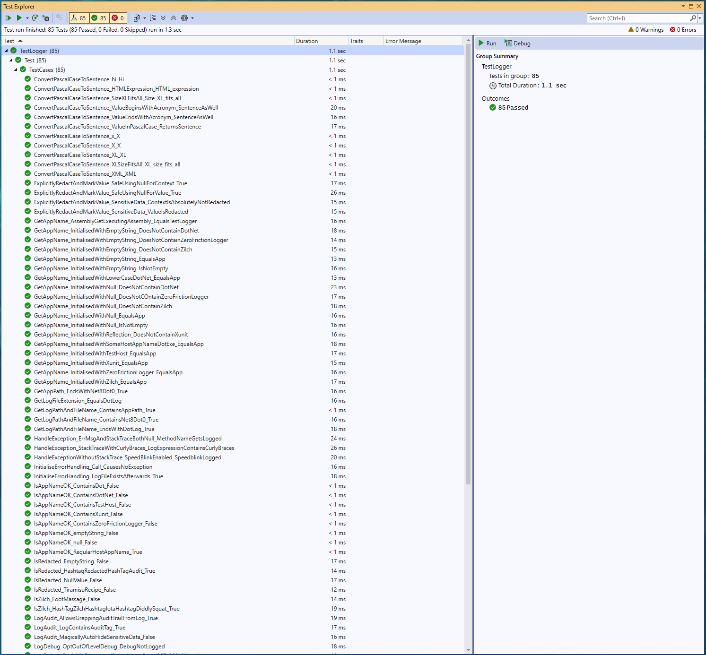
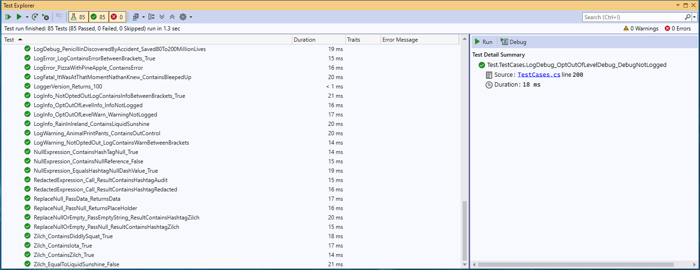
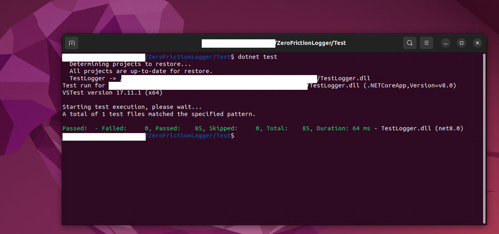

## ZeroFrictionLogger
Zero config, zero dependency exception handler and logger, logs designed for both human reading and automated processing.

Features thread-safe logging, fallback to console and speedblink testing. **logger source code** builds and runs on .NET Core 2.1 and 8.0 LTS; have seen it build and run on Linux with .NET Core 8.0 LTS. Writes to log without caching. Prebuilt **DLL** on NuGet targets `netstandard2.1`; [Logger test project source code, including the logger core](https://github.com/ErikSkoda/ZeroFrictionLogger/tree/main/test/ZeroFrictionLogger.Tests), is available on GitHub. See the **Quick Start** section for... a quick start :)

150-ish lines of executable code, 500+ due to whitespace and comments (MIT-license and for intellisense XML)

See screenshots of passing unit tests and latest documentation updates on [GitHub README](https://github.com/ErikSkoda/ZeroFrictionLogger/blob/main/README.md).

## Context
Originally a by-product of a Test Automation Framework running on tool servers, VMs or bare metal, built to support teams testing mission-critical Systems Under Test running on Dev, Test, Acceptance - and, on one rare occasion, Live environments.

## Why

### No filtering, no surprises
Way back I had to use a mandatory logger. The logger refused to log stack traces with curly braces. I wanted simple not clever. No surprises.

### No additional vulnerability
Way back the test tool I was working on started crashing intermittently at midnight. The mandatory logger included a midnight roll over feature for log file retention. The documentation was elaborate. Looked for but did not find info on how to opt out of the midnight roll over feature. The need was for simple not clever. No additional vulnerability.

### No caching, no loss of data
A while ago the test tool I was using started crashing at 22:00. The tooling failed where it had never failed before, performing trivial tasks during startup which had worked thousands of times for many years. The consistent timing (22:00 plus a few sec) provided a clue the tool might be killed by an external process. Windows Event Viewer confirmed the suspicion. After reaching out to security it turned out they had introduced a new audit tool capable of killing "suspicious" processes. We solved the issue with a slightly changed regression test start time and adding the tool to an allow list. No caching meant no loss of data. The time stamp of the last successfully written log line provided a clue for root cause analysis.

### Simplicity as security feature
Built the original version of the logger way before november 2021. Simplicity means no surprise behaviour through runtime injection.

### App logging only - no OS-level monitoring
The logger records **only** application events - **not** system logs, third party logs or framework-level logs.

Still, this does not mean you have to be blind to environmental issues. Years ago, I asked the infra team next door—already running an enterprise-grade monitoring suite—for disk and memory checks on a tool server. They said it required budget approval, which never came. Later on I built my own checks, logged the results, and included them in the reports.

## Grepable markers
The exception methods (and logAudit) add visual markers, grepable sentinel tags (#exception, #audit) to the log. This allows to extract and share for instance audit reports without/before building them in the host app. Used the approach in a test tool with #summary, #details, #metrics, #S2R (steps to reproduce) enabling provision of reports before having built them. This allowed for initial focus on 1. tool stability and 2. testware validation - a huge time saver. The approach allowed building fancy HTML reports with pie charts and styling later, with the reduced pressure of "nice to have" rather than high-pressure "must have" features, allowing for some much-needed breathing space.

*Come to think of it, you don't even need ZeroFrictionLogger to pull this off.* You can probably do it already with the logger you're using right now. See **Quick Start** for an example.

## Security - don't slam your fingers
The logger contains mechanisms to prevent leaking sensitive data to log. One of several features is HandleExceptionWithoutStackTrace, cousin of HandleException. Intended use for both is in the catch block. It is up to you as host app developer to make an informed choice to omit the stack trace from log when you suspect it might contain sensitive data.

This paragraph is like a sticker on the side of the hammer saying: Don't slam your fingers. Like a hammer the logger contains no functionality to magically auto-prevent you from slamming your fingers.

## Zero config
No config is required. No XML, no JSON, no YAML. You can start developing without ever needing any of that.

### Opt out levels DEBUG, INFO, WARN
As you move from Dev to Ops you may still want to **opt out of log levels DEBUG, INFO and WARN**.

### Three Opt Out Options
1. Comment out calls to `LogDebug`, `LogInfo`, `LogWarning`. Cumbersome and requires changes to code base.
2. Grep out [DEBUG] [INFO] and [WARN] afterwards. Possible, but requires some scripting.
3. Add marker files `no-debug.txt`, `no-info.txt` and `no-warn.txt` to the host app bin folder, checked by `InitialiseErrorHandling`.

You can still start with zero config. Can go LIVE without config. You can opt-out of log levels with minimal complexity and same code base.

The log prepared by `InitialiseErrorHandling` will tell you (and double check) whether levels DEBUG, INFO, WARN are active - and briefly inform on how to opt-out.

### No ejection seat without parachute
Gentle reminder: there is **no way to opt out** of levels [ERROR], [FATAL] and [AUDIT]. That would be like providing a pilot with an ejection seat but without parachute.

While a pilot might be grateful for an ejection seat to leave a burning plane, the gratitude probably lasts longer if a parachute is included.

## Speedblink testing
The exception handling methods include a visual marker, grepable sentinel tag designed to stand out of monotonous log lines.

### idea
*Builds on an insight taught by James Bach, creator of the Rapid Software Testing Methodology.*
The idea being the human brain is hard wired to perceive movement as danger. A literal life hack to survive in a dangerous environment - the savannah.

When watching a fire in a fireplace, camp fire or bonfire our eyes are drawn to the movement of flames. Same for fish swimming in a fish tank or a TV screen with a sports game in a restaurant.

### Opt out
- **Opt out of speedblink marker** by adding `no-speedblink.txt` in the host app bin folder, checked by `InitialiseErrorHandling`
- Alternatively grep out #speedblink afterwards, combining visual markers with improved likelyhood of pipeline compliance.

## Timezone - UTC by default, local possible
Uses Utc time with format yyyy-MM-dd HH:mm:ss by default.

**Opt out of Utc time** in favor of local time by adding marker file `no-utc.txt` in host app bin folder.

## Logfile retention
The app creates the log at start, replacing any previous log. Retention of logfiles is possible using scripts, batchfiles, trusted tools or by the host app making a copy. See **Quick Start** for an example.

## log path and location
Logs are created in the host app bin folder, using the app name with .log extension.

## Quick Start

### Using directive
```csharp
using System.Reflection;
using Err = ZeroFrictionLogger.Log;
```

### Initialise
```csharp
Err.InitialiseErrorHandling(Assembly.GetExecutingAssembly().GetName().Name);
```

### Handle exception
```csharp
catch (Exception ex)
{
    Err.HandleException(MethodBase.GetCurrentMethod().Name, ex.Message, ex.StackTrace);
}
```

### ...without stack trace
```csharp
catch (Exception ex)
{
    Err.HandleExceptionWithoutStackTrace(MethodBase.GetCurrentMethod().Name, ex.Message);
}
```

### Logging
```csharp
Err.LogDebug("Penicillin discovered by accident");
Err.LogInfo("Rain in Ireland identified as liquid sunshine");
Err.LogWarning("Animal print pants outta control");
Err.LogAudit("Calling external process xyz");
Err.LogError("Pizza with pineapple detected");
Err.LogFatal("It was at that moment Nathan knew...");
```

### Opt out of default behaviour, full list
You may want to customize logger behaviour. Here is how:

| Opt out of       | Marker file         | Notes                                                                   |
|------------------|---------------------|-------------------------------------------------------------------------|
| log level DEBUG  | `no-debug.txt`      | Checked once by `InitialiseErrorHandling()`                            |
| log level INFO   | `no-info.txt`       | Checked once by `InitialiseErrorHandling()`                            |
| log level WARN   | `no-warn.txt`       | Checked once by `InitialiseErrorHandling()`                            |
| log level ERROR  | **not possible**    | Always logged                                                          |
| log level FATAL  | **not possible**    | Always logged                                                          |
| log level AUDIT  | **not possible**    | Always logged                                                          |
| speedblink text  | `no-speedblink.txt` | Checked once by `InitialiseErrorHandling()`                            |
| using UTC time   | `no-utc.txt`        | Checked once by `InitialiseErrorHandling()`, alternative is local time |

*`InitialiseErrorHandling()` checks marker file presence in the host app bin folder.* The log starts with a status update on customized behaviour and briefly informs you on how to opt-out.

### Creating a report from grepable markers - Out of scope but not out of heart
While **out of scope** for the logger, extracting an audit (or any) report from logfile based on a grepable marker (here `#audit`) can be a real time saver - allowing you to create reports before they are built.

The one-liner below works from Windows CMD. Tested, works.

`findstr /C:#audit app.log > audit.txt`

### Log file retention - Out of scope but not out of heart
While retention is **out of scope** for the logger itself for the sake of simplicity, you can still archive logs with a timestamp in a straighforward way. Below you find a Windows CMD batch example adding a YYYY-MM-DD_HH_MM_SSmm prefix to `app.log`.

It does pad hours before 10:00 to prevent filename issues. Does not require PowerShell.

Tested it, `app.log` was copied to `2025-08-14_09_09_1228-app.log` **OK**.

``` CMD batch file
set dd=%DATE:~7,2%
set mm=%DATE:~4,2%
set yyyy=%DATE:~-4%
set hh=%time:~0,2%
set hh=%hh: =0%
set min=%time:~3,2%
set ss=%time:~6,2%
set ms=%time:~9,2%

set timestamp=%yyyy%-%mm%-%dd%_%hh%_%min%_%ss%%ms%

REM echo timestamp = %timestamp%

copy app.log %timestamp%-app.log
```

### NuGet package
Nuget package targetting `.netstandard2.1` is available on NuGet.
To use the logger in older environments, build from source (see below)

### TestZeroFriction Source and Unit Test (Living Documentation)
Early adopters can download xUnit test project **TestZeroFrictionLogger.sln** from GitHub, containing:

**Logger core:**
- [`Log.cs`](https://github.com/ErikSkoda/ZeroFrictionLogger/blob/main/test/ZeroFrictionLogger.Tests/Log.cs)
- [`PascalToSentence.cs`](https://github.com/ErikSkoda/ZeroFrictionLogger/blob/main/test/ZeroFrictionLogger.Tests/PascalToSentence.cs)

**Test Suite:**
- `TestCases.cs` (80-ish xUnit unit tests)
- `TestSupport.cs` (log content check)
- `AssemblyInfo.cs` (enforce sequential xUnit test execution)

**Test Project Config:**
- `TestZeroFrictionLogger.sln`
- `Test.csproj` (.NET Core project file)

**Note:** The test project uses [xUnit](https://xunit.net/?tabs=cs) for testing. Make sure you have it installed to build and run the tests. The test project uses .NET 8.0 and the latest xUnit packages. While the logger core supports .NET 6.0 (and earlier), the *test project* will **not** build on .NET 6.0.

Tried and failed to downgrade to earlier versions of `xunit`, `xunit.runner.visualstudio` and `Microsoft.NET.Test.Sdk` to support both .NET Core 8.0 and 6.0. Currently, the xUnit test project - using the latest components - only builds and runs on **.NET Core 8.0**. May resurrect a minimalistic, archaic unit test tool from the digital scrap heap to support unit testing the logger on older .NET Core versions still in corporate use.

:white_check_mark: **Unit tests pass on both Windows and Linux (Ubuntu LTS)**
All unit tests were confirmed passing before sharing the test project on GitHub.

### Platform Compatibility Matrix

| ZeroFrictionLogger                               | Windows        | Linux (LTS)    | Mac OS           |
|--------------------------------------------------|----------------|----------------|------------------|
| Builds on .NET Core 8.0                          | :white_check_mark: OK          | :white_check_mark: OK          | :hourglass_flowing_sand: Not confirmed |
| Runs on .NET Core 8.0 (demo app)                 | :white_check_mark: OK          | :white_check_mark: OK          | :hourglass_flowing_sand: Not confirmed |
| xUnit unit tests passing with .NET Core 8.0      | :white_check_mark: OK          | :white_check_mark: OK          | :hourglass_flowing_sand: Not confirmed |
| Builds on .NET Core 6.0                          | :white_check_mark: OK          | :hourglass_flowing_sand: Not confirmed   | :hourglass_flowing_sand: Not confirmed |
| Runs on .NET Core 6.0 (demo app)                 | :white_check_mark: OK          | :hourglass_flowing_sand: Not confirmed   | :hourglass_flowing_sand: Not confirmed |
| xUnit unit tests passing with .NET Core 6.0      | :x: Not building | :x: Not building | :hourglass_flowing_sand: Not confirmed   |
| Builds on .NET Core 2.1 *(Out of Service)*       | :white_check_mark: builds :warning: end-of-life   | :warning: end-of-life   | :warning: end-of-life     |
| Runs on .NET Core 2.1 *(Out of Service)* (demo)  | :white_check_mark: runs :warning: end-of-life     | :warning: end-of-life   | :warning: end-of-life     |

:warning: .NET Core 2.1 is out of support.

### Build from Source
1. Download [`log.cs`](https://github.com/ErikSkoda/ZeroFrictionLogger/blob/main/test/ZeroFrictionLogger.Tests/Log.cs)` and `[PascalToSentence.cs](https://github.com/ErikSkoda/ZeroFrictionLogger/blob/main/test/ZeroFrictionLogger.Tests/PascalToSentence.cs) from GitHub.
2. In Solution Explorer:
- Right-click on your Project
- Select **Add -> Existing item...**
3. Select the two downloaded `.cs` files and click **Add**

## UTF-8
UTF-8 Encoding without BOM should take care of compatibility with many other tools downstream.

## Fall back to console
Failure to create or write to logfile to the host app bin folder (no write permissions?) will result in logging to console. If need be, redirection of console output to file in another folder using > or >> can provide a quick fix on both Windows and Linux.

## Portability
Builds on Windows and Linux, Demo app runs on Windows and Linux. All unit tests pass on Windows and Linux. **Should** work on MacOS - which is a fancy way of saying it still needs to be confirmed.

## Compatibility
Developing, building, running and unit testing using .NET Core 8.0 LTS.
Builds and runs on Windows in a console application with .NET Core 2.1 (Out of Support)

## Scaling
The logger allows a quick start at small scale.
Scaling is possible with some opt out features, scripts and tools around the two core class modules.
Will look into post processing for integration with the dashboard tool Grafana at a later stage.

## Migration
There are **many** great and feature rich loggers out there, some including advanced telemetry. Will deliberately keep this logger simple not clever, lean and ...minimalistic. Being aware your host app may outgrow the possibilities of ZeroFrictionLogger, the best I can do to facilitate later migration to a feature rich enterprise logger is to provide transparent examples, unit tests and full documentation. See below.

## Example log output
```text
2025-07-21 08:29:17 [AUDIT] start log. #audit
2025-07-21 08:29:17 [AUDIT] Start log initialisation for app: ConsoleAppWithLogging #audit
2025-07-21 08:29:17 [AUDIT] debug enabled = True due to presence/absence of no-debug.txt in app path at initialisation #audit
2025-07-21 08:29:17 [AUDIT] info enabled = True due to presence/absence of no-info.txt in app path at initialisation #audit
2025-07-21 08:29:17 [AUDIT] warn enabled = True due to presence/absence of no-warn.txt in app path at initialisation #audit
2025-07-21 08:29:17 [AUDIT] utc enabled = True due to presence/absence of no-utc.txt in app path at initialisation #audit
2025-07-21 08:29:17 [AUDIT] speedblink icon enabled = True due to presence/absence of no-speedblink.txt in app path at initialisation #audit
2025-07-21 08:29:17 [DEBUG] double check loglevel debug
2025-07-21 08:29:17 [INFO] double check loglevel info
2025-07-21 08:29:17 [WARN] double check loglevel warn
2025-07-21 08:29:17 [AUDIT] Gentle reminder: levels [ERROR], [FATAL] and [AUDIT] can not be disabled. #audit
2025-07-21 08:29:17 [AUDIT] Log initialisation complete. #audit
...
2025-07-21 08:29:35 [INFO] Rain in Ireland has been referred to me as liquid sunshine.
2025-07-21 08:29:35 [WARN] Animal print pants out control.
2025-07-21 08:29:35 [ERROR] Pizza with pineapple is a recoverable error.
2025-07-21 08:29:35 [FATAL] It was at that moment Nathan knew, he'd bleep-ed up.
...
2025-07-21 08:29:35 #speedblink
      ___   __  __   ___    #speedblink
     |  _|  \ \/ /  |_  |   #speedblink
     | |     \  /     | |   #speedblink
     | |_    /  \    _| |   #speedblink
     |___|  /_/\_\  |___|   #speedblink
                            #speedblink
2025-07-21 08:29:35 [ERROR] Cause exception for demo purpose
2025-07-21 08:29:35 [ERROR] Attempted to divide by zero. #exception
2025-07-21 08:29:35 [ERROR] tech info: Attempted to divide by zero. stack trace: #redacted #audit
```

## Unit tests
Check out the [xunit unit test project](https://github.com/ErikSkoda/ZeroFrictionLogger/tree/main/test/ZeroFrictionLogger.Tests) for verification and living documentation through practical examples.





## Full documentation  
Public method documentation of [`log.cs`](https://github.com/ErikSkoda/ZeroFrictionLogger/blob/main/test/ZeroFrictionLogger.Tests/Log.cs).

### LoggerVersion
Marker to be checked in unit tests to **prove** unit tests are indeed using the **expected version** of the DLL.

**Returns:** `build nr of logger to be published`

---

### Zilch  
Visual markers, grepable sentinel tags to catch an  
uninitialized state and to prevent silent errors.

**Returns:** `#zilch #iota #diddly-squat`

---

### IsZilch  
Checks whether a value equals `Zilch()`.

**Parameters:**  
- `value`

**Returns:** boolean

---

### NotZilch  
Checks whether a value is different from `Zilch()`.

**Parameters:**  
- `value`

**Returns:** boolean

---

### NullExpression  
Visual markers, grepable sentinel tag to catch an  
uninitialized state and to prevent silent errors.

**Returns:** `#null-value`

---

### ReplaceNull  
Returns the passed value unless it's null, in which case it returns  
sentinel tag `#null-value`.

**Parameters:**  
- `value`

**Returns:** `value` or `#null-value`

---

### ReplaceNullOrEmpty  
Returns the passed value unless it's null or empty,  
in which case it returns `#zilch #iota #diddly-squat`.

**Parameters:**  
- `value`

**Returns:** `value` or `#zilch #iota #diddly-squat`

---

### RedactedExpression  
Visual marker, grepable sentinel value for replacing data to be redacted.

**Returns:** `#redacted #audit`

---

### IsRedacted  
Checks whether an expression equals `#redacted #audit`.  
Changed from private to public for unit testing.  
Returns false when value is null.

**Parameters:**  
- `value`

**Returns:** boolean

---

### ExplicitlyRedactAndMarkValue  
Method replacing the value passed with visible, grepable markers `#redacted #audit`.  
Value is in explicitly hiding sensitive data and providing the audit trail to prove it.  

Example:  

    ZeroFrictionLogger.Log.LogInfo("log in using uid: " + uid +
        " and pwd: " + Err.ExplicitlyRedactAndMarkValue("password", pwd));

The method is null safe, still returns the markers as expected when value is null.  
Also returns the markers as expected when context is null, replacing context with a missing context message.

**Parameters:**  
- `context`  
- `value`

**Returns:** `[context] + #redacted #audit`

---

### GetLogFileExtension  
Returns log file extension for use by host application for handling log file retention.

**Returns:** `.log`

---

### GetAppName  
Returns the app name passed to InitialiseErrorHandling. If the passed app name is: `null`, `empty string` or contains `dotnet`, `xunit`, `testhost`,  `zerofrictionlogger`, `zilch` or `.`, then the logger defaults to `"app"`.

**Returns:** host app name

---

### GetAppPath  
Returns host app path using `System.AppContext`.

**Returns:** host app path

---

### GetLogPathAndFilename  
Returns app path and app name based logfile name.

**Returns:** logfile path and filename

---

### ConvertPascalCaseToSentence  
Converts expression (for instance method name) in PascalCase  
into a sentence (hopefully documenting the method).  
Replaces a call to the Humanizer package to remain at zero dependencies.

**Parameters:**  
- `value`

**Returns:** sentence

---

### LogDebug  
Logs message at DEBUG level. Opt-out by adding marker file:  
`no-debug.txt` in host app path, checked during log initialisation.  
Writes data instantly without caching.  

**Note:** Logger contains no logic for magically auto-hiding sensitive information.  
As host app dev you remain responsible to prevent sensitive data from entering logs.

**Parameters:**  
- `msg`

---

### LogInfo  
Logs message at INFO level. Opt-out by adding marker file:  
`no-info.txt` in host app path, checked during log initialisation.  
Writes data instantly without caching.  

**Note:** Logger contains no logic for magically auto-hiding sensitive information.  
As host app dev you remain responsible to prevent sensitive data from entering logs.

**Parameters:**  
- `msg`

---

### LogWarning  
Logs message at WARN level. Opt-out by adding marker file:  
`no-warn.txt` in host app path, checked during log initialisation.  
Writes data instantly without caching.  

**Note:** Logger contains no logic for magically auto-hiding sensitive information.  
As host app dev you remain responsible to prevent sensitive data from entering logs.

**Parameters:**  
- `msg`

---

### LogError  
Logs message at ERROR level.  
Writes data instantly without caching.  

**Note:** Logger contains no logic for magically auto-hiding sensitive information.  
As host app dev you remain responsible to prevent sensitive data from entering logs.

**Parameters:**  
- `msg`

---

### LogFatal  
Logs message at AUDIT level. Also writes grepable sentinel tag `#audit` for  
extracting an audit trail from log. Useful when making calls to external processes, URLs, or APIs  
in the host application, providing a means to extract audit reports via grep tools.  
Writes data instantly without caching.  

**Note:** Logger contains no logic for magically auto-hiding sensitive information.  
As host app dev you remain responsible to prevent sensitive data from entering logs.

**Parameters:**  
- `msg`

---

### LogAudit  
Logs message at AUDIT level. Also writes grepable sentinel tag `#audit` for  
extracting an audit trail from log. Useful when making calls to external processes, URLs, or APIs  
in the host application, providing a means to extract audit reports via grep tools.  
Writes data instantly without caching.  

**Note:** Logger contains no logic for magically auto-hiding sensitive information.  
As host app dev you remain responsible to prevent sensitive data from entering logs.

**Parameters:**  
- `msg`

---

### IsAppNameOK
**Public for unit test only**. Called by InitialiseErrorHandling. 
Check whether the appname, passed 
from host app or generated by logger is appropriate.
Inappropriate app names are `null`, empty string or containing `dotnet`, `xunit`, 
`testhost`, `zerofrictionlogger`, `zilch` or `.`.

**Parameters:**
- `appName` host app name passed to `InitialiseErrorHandling`

---

### HandleException  
Bread-and-butter method for handling exceptions in try-catch blocks.  
Logs at ERROR level and also writes a speedblink message by default.  
Opt-out by including marker file: `no-speedblink.txt` in host app path,  
checked during log initialisation. Writes data to log instantly without caching.  

**Note:** Logger contains no logic for magically auto-hiding sensitive information.  
As host app dev you remain responsible to prevent sensitive data from entering logs.

**Parameters:**  
- `methodName` methodname obtained through reflection: MethodBase.GetCurrentMethod().Name
- `errMsg` exception message from catch block, `ex.Message`
- `stackTrace` stack trace from catch block, `ex.StackTrace`

---

### HandleExceptionWithoutStackTrace  
If you as a host app dev suspect sensitive data might leak into logfile through  
the exception stack trace message, use `HandleExceptionWithoutStackTrace` in  
the try-catch block. Works similar to its cousin `HandleException` but replaces  
the stack trace message with grepable sentinel tags `#redacted #audit`.  

**Note:** Logger contains no logic for magically auto-hiding sensitive information.  
As host app dev you remain responsible to prevent sensitive data from entering logs.
**Parameters:**  
then
- `methodName` using reflection: `MethodBase.GetCurrentMethod().Name`
- `errMsg` exception message from catch block, `ex.Message`

---

### InitialiseErrorHandling  
One-stop method for starting exception handling and logging, no config needed.  
Attempts to create a logfile in app folder with app name and `.log` extension at  
each start of the app if possible. If write access is absent the fallback is  
to log to console. Failure to create or write to logfile (no write permissions)  
will result in an ASCII icon displayed in console with explanation.  
Redirection of console output to file in another folder using `>` or `>>`  
is possible on both Windows and Linux as a workaround.

Retention of logfiles can be achieved by shell scripts, batch files, or by  
the host application making a copy.

In case the host appname passed to InitiliaseErrorHandling is `null`, an empty string
or contains any of the expressions `dotnet`, `xunit`, `testhost`, 
`zerofrictionlogger`, `zilch` or `.` (not case sensitive) the logger will fall back 
to the hard coded expression `"app"`.		

**parameters**
- `appName` appName passed explicitly from the host app using reflection or as string.

---

## Project Policies
- Please see [CONTRIBUTING.md](https://github.com/ErikSkoda/ZeroFrictionLogger/blob/main/CONTRIBUTING.md) for contribution guidelines.
- Review our [Code of Conduct](https://github.com/ErikSkoda/ZeroFrictionLogger/blob/main/CODE_OF_CONDUCT.md) to understand community standards.


